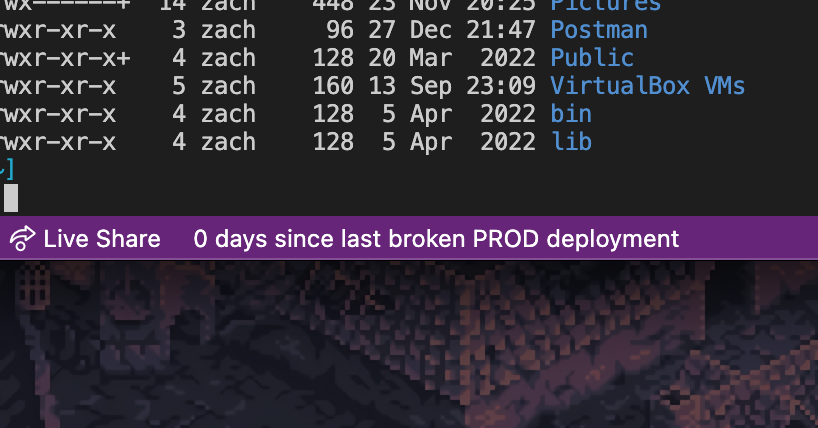
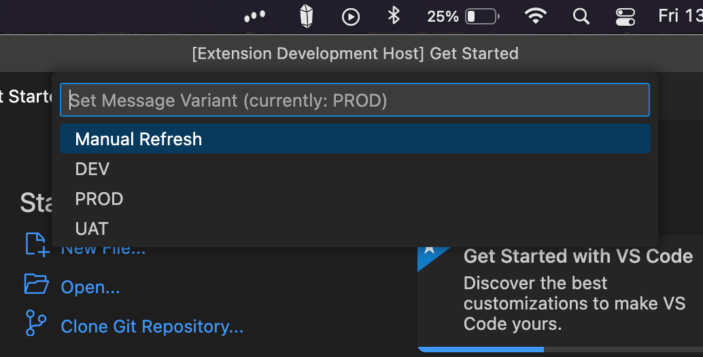
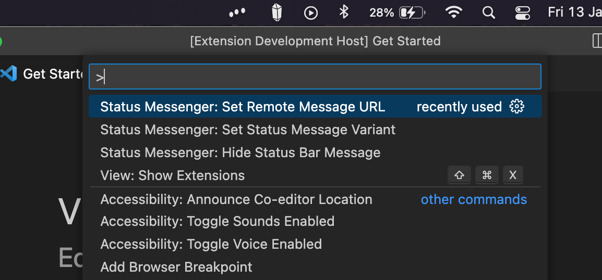

# status-messenger

Status Messenger allow you to have message appear in your VS Code status bar sourced from a remote server periodically updates

## Features

Connects to an arbitrary API that passes JSON object with messages, and displays them in the status bar of VS Code.  The server is polled every 20 mins.

Can have an arbitrary number of messages from the same server, with the client chosing which to display at anytime.

## Requirements

Requires a server and API to be set up to serve JSON files to display. An example implementation can be found [here](https://github.com/pavo-etc/api).

Once you have installed the extension, set up your remote URL by running **Set Remote Message URL**. This will take you through the setup.

## Known Issues

Calling out known issues can help limit users opening duplicate issues against your extension.

## Release Notes

Users appreciate release notes as you update your extension.

### 1.0.0

Initial release of ...

### 1.0.1

Fixed issue #.

### 1.1.0

Added features X, Y, and Z.

---

## Following extension guidelines

Ensure that you've read through the extensions guidelines and follow the best practices for creating your extension.

* [Extension Guidelines](https://code.visualstudio.com/api/references/extension-guidelines)

## Working with Markdown

You can author your README using Visual Studio Code. Here are some useful editor keyboard shortcuts:

* Split the editor (`Cmd+\` on macOS or `Ctrl+\` on Windows and Linux).
* Toggle preview (`Shift+Cmd+V` on macOS or `Shift+Ctrl+V` on Windows and Linux).
* Press `Ctrl+Space` (Windows, Linux, macOS) to see a list of Markdown snippets.

## For more information

* [Visual Studio Code's Markdown Support](http://code.visualstudio.com/docs/languages/markdown)
* [Markdown Syntax Reference](https://help.github.com/articles/markdown-basics/)

**Enjoy!**
